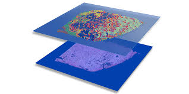

Unification and Benchmarking of Segmentation Methods for Spatial Transcriptomics   
===========

This repository includes the supplementary materials and code for the paper titled [Unification and Benchmarking of Segmentation Methods for Spatial Transcriptomics](). The research **evaluates various methodologies in spatial transcriptomics**, providing insights into their performance and offering recommendations for **best practices** in data analysis. Additionally, we present a **Nextflow framework** that serves as a baseline for future benchmarking efforts. This framework is **highly adaptable and user-friendly**, allowing for the seamless incorporation of new segmentation methods as they emerge in the field of spatial transcriptomics.

Table of contents:
- [Background](#background)
- [Methods](#methods)
- [Datasets](#datasets)
- [Evaluation](#evaluation)
- [Results](#results)
- [Installation](#installation)
- [Usage](#usage)

# Background
Spatial transcriptomics has emerged as a pivotal technique for understanding tissue architecture and cellular interactions. However, the rapid development of various spatial transcriptomics methods necessitates rigorous benchmarking to **guide researchers in selecting appropriate tools** for their studies. This work systematically evaluates several spatial transcriptomics methods based on a variety of performance metrics.

# Methods
The following methodologies were benchmarked:

- **Watershed**: The watershed segmentation method utilizes multi-class Otsu thresholding and peak detection to accurately delineate nuclei in spatial transcriptomics images, effectively distinguishing them from the background.
- **Cellpose**: CellPose employs a deep learning framework with a U-Net-like architecture to segment cells based on shape and internal structure, generating vector fields that refine segmentation results while improving image quality through noise reduction.
- **SCS**: Subcellular Spatial Transcriptomics Cell Segmentation (SCS) integrates staining and transcriptomic data, utilizing a traditional watershed algorithm alongside a transformer neural network to accurately predict cellular relationships and enable detailed analyses of RNA localization.
- **Baysor**: Baysor combines molecular position data with optional staining using a Bayesian mixture model and Markov Random Field approach, optimizing cell boundary delineation while maintaining spatial coherence and enhancing segmentation accuracy across various tissue conditions.
- **BIDCell**: BidCell features a self-supervised deep learning framework with a Bidirectional U-Net3+ architecture that leverages biological insights to accurately segment cells in subcellular spatial transcriptomics without the need for manual annotations.
- **SAM**: The Segment Anything Model (SAM) utilizes a Vision Transformer to perform real-time, prompt-based segmentation across diverse tasks, expanding its training dataset through a cycle of model-assisted data annotation for enhanced robustness.
- **SAM2**: SAM2 builds upon the original SAM framework, incorporating streaming memory and iterative prompting capabilities for effective video and image segmentation, allowing for real-time object tracking and improved accuracy across complex content.
- **mSAM**: mSAM extends the Segment Anything Model (SAM) to multidimensional microscopy data with enhanced segmentation for light and electron microscopy.
It uses fine-tuned SAM models to compute image embeddings and applies automatic mask generation for accurate cell delineation.
- **CelloType**: CelloType is a transformer-based model combining Swin Transformer and MaskDINO for joint cell segmentation and classification. It processes microscopy images to generate instance masks with cell type labels using a pretrained model and GPU acceleration. Results are post-processed into coordinate-label files for reproducible analysis across multiple spatial transcriptomics datasets.

# Datasets
Following datasets consist only on the formatted transcripts and images files, go to corresponding autor references for original datasets.
| Dataset | Raw data link | Technology | scRNA-seq annotation reference data used | Download data |
|    :---:    |    :---:    |    :---:    |    :---:    |    :---:    |
| Brain | [MOSTA](https://db.cngb.org/stomics/mosta/download/) | StereoSeq | [Paper link](https://www.sciencedirect.com/science/article/pii/S0092867418308031) | [Transcripts and Image](https://figshare.com/s/bae16750c3e006eaccc8) |
| Brain | [ZENODO](https://zenodo.org/records/7332091) | STARmap PLUS | [Paper link](https://www.nature.com/articles/s41593-022-01251-x) | [Transcripts and Image](https://zenodo.org/records/7332091) |
| Brain | [Brain image library](https://doi.brainimagelibrary.org/doi/10.35077/g.21) | MERFISH | [Paper link](https://www.nature.com/articles/s41586-021-03705-x) | [Transcripts and Image](https://doi.brainimagelibrary.org/doi/10.35077/g.21) |
| Breast | [10x Genomics](https://www.nature.com/articles/s41467-023-43458-x) | Xenium | [Paper link](https://www.nature.com/articles/s41588-021-00911-1) | [Transcripts and Image](https://figshare.com/s/20c57a21ac44fd150034) |
| Embrio | [MOSTA](https://db.cngb.org/stomics/mosta/download/) | StereoSeq | [Paper link](https://www.nature.com/articles/s41586-019-0969-x) | [Transcripts and Image](https://figshare.com/s/b110c99ba8990031b793) |
| Lung | [Nanostring](https://nanostring.com/products/cosmx-spatial-molecular-imager/ffpe-dataset/nsclc-ffpe-dataset/) | CosMx | [Paper link](https://www.nature.com/articles/s41588-022-01243-4) | [Transcripts and Image](https://figshare.com/s/a43bd679de1274f80e8a) |
| Pancreas | [Nanostring](https://nanostring.com/products/cosmx-spatial-molecular-imager/ffpe-dataset/cosmx-smi-human-pancreas-ffpe-dataset/) | CosMx | [Paper link](https://www.science.org/doi/10.1126/science.abl4896) | [Transcripts and Image](https://figshare.com/s/fc5beeb662a2ee1d455e) |

# Evaluation
The evaluation was performed using the five datasets presented. The metrics employed were derived from the [BIDCell proposed metrics](https://www.nature.com/articles/s41467-023-44560-w). You can find the [code for evaluation](https://github.com/TranslationalBioinformaticsUnit/Benchmarking-SegmentationMethods-ST/tree/main/Evaluation) and visualization generation in this repository.

# Results
The findings highlight **significant differences in performance** across the evaluated methods, **influencing the choice of method** based on specific research questions and data characteristics. Detailed results, including comparisons and statistical analyses, are provided in the [paper]().

# Installation
To run the code and reproduce the results, please ensure you have the following conda environments installed:

- **scs**: This conda environment is used for running SCS, Baysor and Watershed tools
- **cellpose**: This conda environment is used for running Cellpose
- **bidcell**: This conda environment is used for running BIDCell
- **cellotype**: This conda environment is used for running CelloType
- **Kernel**: This conda environment is used for running the evaluation

In case you are interested in **running the Nextflow pipeline** (instead of a specific segmentation method) for running the corresponding scripts, ensure they are installed prior to run the Nextflow pipeline.

# Usage
**Running each segmentation method** is possible with [tool specific codes](https://github.com/TranslationalBioinformaticsUnit/Benchmarking-SegmentationMethods-ST/tree/main/src) provided in this repository.

The Nextflow pipeline provides a scalable and user-friendly framework for benchmarking segmentation methods. Expanding the pipeline is straightforward—simply create a new entry for the tool you wish to benchmark and integrate it into the Nextflow workflow.

[Running the Nextflow](https://github.com/TranslationalBioinformaticsUnit/Benchmarking-SegmentationMethods-ST/tree/main/Nextflow) is also simple, just follow this steps:
- **Install Nextflow**: Install nextflow in you system [Nextflow installation guideline](https://www.nextflow.io/docs/latest/install.html) 
- **Nextflow directory**: Clone the Nextflow directory provided in this repository.
- **Change output directory**: Change the output directory where outcomes should be stored in main.nf file.
- **Add input data**: Add to the input_data folder (**"../nextflow/input_data/"**) the two required files, the **trsanscripts and the image**.
- **Run the Nextflow**: Run the command 
      ```
      $ nextflow run .../nextflow/main.nf
      ```

The pipeline will preprocess, generate the patches and run the added segmentation tools 
(moddify "**../nextflow/main.nf**" to adapt any preprocessing step or the selection of segmentation tools).

# Contributing
Contributions to improve this repository are welcome! If you have suggestions or improvements, please open an issue or submit a pull request.
